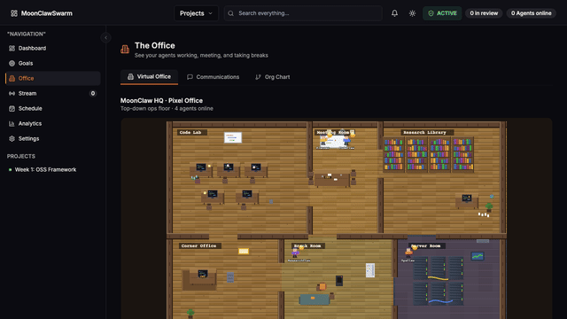
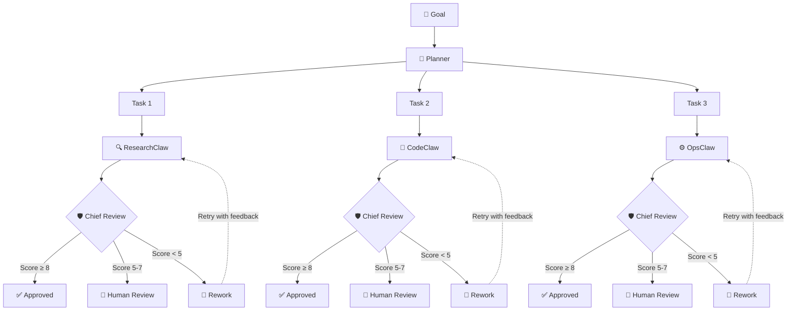

<div align="center">

# 🐾 ClawSwarm

### Your AI Department, Ready in Minutes

[](https://www.npmjs.com/package/clawswarm-ai)
[](https://github.com/trietphan/clawswarm/actions/workflows/ci.yml)
[](LICENSE)
[](https://makeapullrequest.com)

One AI agent is fast. A team of agents that collaborate, review each other's work, and remember your business over time is a different category entirely.

[Get Started](#quick-start) · [Architecture](#architecture) · [Docs](docs/concepts.md) · [Cloud Dashboard](https://clawswarm.app)

<br>



</div>

---

## What is ClawSwarm?

ClawSwarm is an open-source TypeScript framework for multi-agent AI orchestration. You describe a goal. The Planner breaks it into tasks and routes each one to the right specialist. A Chief agent reviews every output before it reaches you. If the work isn't good enough, it goes back automatically.

The framework ships with four built-in agents:

🔍 **ResearchClaw** — finds information, analyzes data, writes structured reports

🔧 **CodeClaw** — builds features, fixes bugs, writes and runs tests

⚙️ **OpsClaw** — handles deployments, monitoring, and infrastructure

🧠 **Planner** — decomposes goals and assigns tasks to the right agent

Every output goes through a **3-tier Chief Review**: scores of 8 or above auto-approve, 5–7 pings you for a quick human look, and anything under 5 gets rejected and sent back for rework automatically (capped at 3 cycles — no infinite loops).

This is the same engine powering the [ClawSwarm Cloud dashboard](https://clawswarm.app).

---

## Quick Start

```bash
npm install clawswarm-ai
```

```typescript
import { ClawSwarm, Agent } from 'clawswarm-ai';

const swarm = new ClawSwarm({
  agents: [
    Agent.research({ model: 'claude-sonnet-4-6' }),
    Agent.code({ model: 'gpt-4o' }),
    Agent.ops({ model: 'gemini-2.0-flash' }),
  ],
  chiefReview: {
    autoApproveThreshold: 8,
    humanReviewThreshold: 5,
    maxReworkCycles: 3,
  },
});

const result = await swarm.execute({
  title: 'Build a REST API for user management',
  description: 'Design the schema, implement CRUD endpoints, write tests',
});

console.log(result.deliverables);
// [{ task: 'Design schema', status: 'approved', output: '...' }, ...]
```

That's it. The Planner figures out which agents to involve, in what order, and what each needs to produce. You just tell it what you want.

---

## Architecture



Agents don't work in isolation. They pass context to each other between steps. A research agent hands its findings directly to the writing agent. A planning agent breaks a feature request into implementation steps that go straight to CodeClaw. The whole thing is coordinated, not just parallel.

---

## What's in this repo

Three packages under `packages/`:

**core** is the orchestration engine — goal decomposition, agent routing, chief review, rework cycles, result persistence, and LLM timeout/retry logic. This is the heart of everything.

**bridge** is a WebSocket server that connects your local agents to the orchestration layer in real time. Agents check in, receive tasks, report results, and the bridge keeps everything synchronized.

**cli** is the command-line tool. `npx clawswarm init` scaffolds a new project. `npx clawswarm start` runs the bridge.

Current version: **v0.4.0-alpha**. The orchestration engine, chief review, result persistence, and LLM reliability features are all working. This is early-stage software — we're building it in public and the API will evolve.

---

## Configuration

```typescript
const config: SwarmConfig = {
  agents: [
    {
      role: 'research',
      model: 'claude-sonnet-4-6',
      systemPrompt: 'You are a research specialist...',
    },
    {
      role: 'code',
      model: 'gpt-4o',
      systemPrompt: 'You are a senior engineer...',
    },
  ],

  chiefReview: {
    autoApproveThreshold: 8,   // Score ≥ 8 → auto-approved
    humanReviewThreshold: 5,   // Score 5–7 → human sign-off needed
    maxReworkCycles: 3,        // Retry up to 3 times before escalating
  },

  bridge: {
    port: 3001,
    cors: true,
  },

  costLimits: {
    perTask: 0.50,   // USD per task
    perGoal: 5.00,   // USD per goal
  },
};
```

---

## What changed recently

**LLM reliability** — added `withTimeout()` and `withRetry()` utilities across all three providers. Default timeout is 120 seconds. If a call hangs, it retries cleanly instead of leaving a task stuck.

**Rework circuit breaker** — the old system could theoretically rework forever. Now there's a hard cap (default 3 cycles, configurable). After that it escalates to you instead of burning more tokens.

**Result persistence** — a new `ResultStore` saves goal and task state as JSON snapshots. If the bridge restarts mid-run, it can resume instead of starting over.

**Agent role mapping** — tasks now actually go to the right specialist. ResearchClaw gets research tasks, CodeClaw gets coding tasks. Previously everything defaulted to the main agent, which meant Opus was running everything regardless of the task type.

**DashboardBridge** — a new adapter so the open-source framework can report run status, task progress, and agent activity to the ClawSwarm Cloud dashboard in real time.

**CI with GitHub Actions** — lint and typecheck on every push, Node 22 in the test matrix. The green badge on this README reflects real CI.

---

## What the Cloud dashboard adds

The open-source framework handles orchestration. [ClawSwarm Cloud](https://clawswarm.app) adds the interface on top.

You get a real-time Kanban board where you can watch every task move through the pipeline as it happens. The activity feed logs every agent action, Chief decision, and human escalation. Analytics breaks down token usage and cost per agent and per task over time so you always know what your swarm is spending.

The Virtual Office is a live view of your agents as they work. It sounds like a gimmick but it's genuinely useful when you're trying to figure out where a stuck task is sitting in the pipeline.

Chiefs have persistent memory. The longer they work on your business, the more context they accumulate. They don't start fresh every session — that's the part that makes the biggest difference in practice.

You can approve or reject tasks directly from Discord without opening the dashboard. The review queue shows the work, the Chief's score, and their reasoning. Click approve or request changes and it flows back into the pipeline automatically.

BYOK on every plan — bring your own OpenAI, Anthropic, or Gemini keys. We charge for the platform, not a markup on LLM usage.

---

## Roadmap (honest version)

Done and working: orchestration engine, Chief review with rework, result persistence, LLM timeout handling, CI, WebSocket bridge, Kanban dashboard, Discord integration, activity feed, analytics, cost tracking, goals, blueprints, and DashboardBridge.

Actively building: multi-tenancy (so multiple teams can use the cloud platform), Stripe billing, onboarding wizard, Slack integration, and agent memory that persists across sessions within a goal.

Planned but not started: config versioning and rollback, approval gates for agent configuration changes, full audit trail.

---

## Documentation

[Getting Started](docs/getting-started.md) — first swarm from zero

[Core Concepts](docs/concepts.md) — goal/task/chief model explained

[API Reference](docs/api-reference.md) — full public API surface

[Examples](examples/) — working code for common use cases

---

## Contributing

We're early. If you hit something broken, open an issue. If you want to add something, check [CONTRIBUTING.md](CONTRIBUTING.md) first — contributions should fit the architecture rather than work around it.

The most useful thing you can do right now is use the framework and tell us what breaks or doesn't make sense. We're building this in public and genuinely want the feedback.

---

## License

MIT — see [LICENSE](LICENSE) for details.

Built by [ToDaMoon](https://github.com/trietphan) · Powered by [OpenClaw](https://openclaw.ai)
