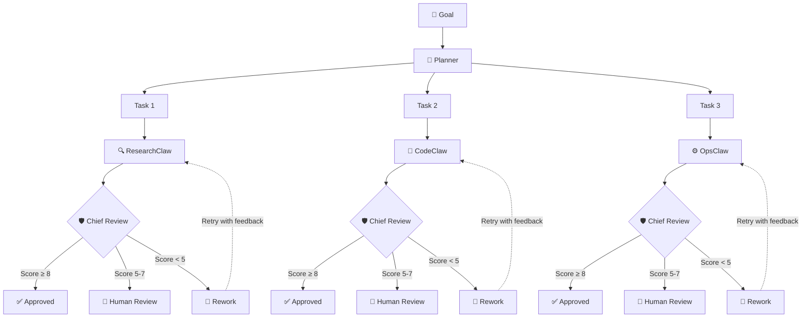

<div align="center">

# 🐾 ClawSwarm

**A TypeScript framework for orchestrating multi-agent AI swarms with hierarchical review.**

[](https://www.npmjs.com/package/clawswarm)
[](https://github.com/trietphan/clawswarm/actions/workflows/ci.yml)
[](LICENSE)
[](https://makeapullrequest.com)

Describe a goal. ClawSwarm decomposes it into tasks, assigns specialist agents,
reviews every output through a chief quality gate, and delivers results — automatically.

[Quick Start](#quick-start) · [Architecture](#architecture) · [Docs](docs/concepts.md) · [Contributing](CONTRIBUTING.md)

</div>

---

## Why ClawSwarm?

Single-agent systems hit a wall — they hallucinate, lose context, and can't self-correct. ClawSwarm takes a different approach: **a team of specialist agents** that plan, execute, and review each other's work, just like a real team.

The result? Higher-quality output, automatic error recovery, and full cost visibility across every task.

## ✨ Features

- 🎯 **Goal Decomposition** — describe what you want; the planner breaks it into assignable tasks
- 🤖 **Multi-Model Support** — mix Claude, GPT-4, Gemini, or any OpenAI-compatible provider per agent
- 🛡️ **Hierarchical Chief Review** — 3-tier quality gate (auto-approve / human review / auto-reject + rework)
- 🔄 **Auto-Rework Cycles** — failed tasks retry automatically with feedback (configurable max attempts)
- 🌐 **Real-Time Bridge** — WebSocket-based communication layer for live agent coordination
- 📊 **Typed Events** — fully typed event system for monitoring, logging, and custom integrations
- 📦 **Extensible Agents** — add custom agents with specialized tools and system prompts
- 💰 **Cost Tracking** — per-agent, per-task token usage and cost monitoring out of the box

## Quick Start

### Install

```bash
npm install clawswarm
```

### Run Your First Swarm

```typescript
import { ClawSwarm, Agent, BridgeServer } from 'clawswarm';

const swarm = new ClawSwarm({
  agents: [
    Agent.research({ model: 'claude-sonnet-4' }),
    Agent.code({ model: 'gpt-4o' }),
    Agent.ops({ model: 'gemini-2.0-flash' }),
  ],
  chiefReview: {
    autoApproveThreshold: 8,
    humanReviewThreshold: 5,
    maxReworkCycles: 3,
  },
});

const result = await swarm.execute({
  title: 'Build a REST API for user management',
  description: 'Design schema, implement CRUD endpoints, write tests',
});

console.log(result.deliverables);
// → [{ task: 'Design schema', status: 'approved', output: '...' }, ...]
```

That's it — the planner decomposes the goal, agents execute in parallel where possible, and every output passes chief review before being delivered.

### CLI

```bash
# Initialize a new project (interactive wizard)
npx clawswarm init

# Execute a goal from the command line
npx clawswarm run "Research the top 5 AI frameworks in 2026"

# Start the bridge server for real-time updates
npx clawswarm start

# Show agent and task status
npx clawswarm status
```

## Architecture



<details>
<summary>ASCII version (for terminals)</summary>

```
  Goal
   │
   ▼
  Planner ──── decomposes into tasks
   │
   ├──────────────┬──────────────┐
   ▼              ▼              ▼
 Task 1        Task 2        Task 3
   │              │              │
   ▼              ▼              ▼
ResearchClaw   CodeClaw      OpsClaw
   │              │              │
   ▼              ▼              ▼
Chief Review   Chief Review   Chief Review
   │              │              │
   ├─ ≥8 ✅ Approve  ├─ ≥8 ✅ Approve  ├─ ≥8 ✅ Approve
   ├─ 5-7 👀 Review  ├─ 5-7 👀 Review  ├─ 5-7 👀 Review
   └─ <5 🔄 Rework   └─ <5 🔄 Rework   └─ <5 🔄 Rework
          │                  │                  │
          └──── retry ───────┘──── retry ───────┘
```

</details>

## Package Structure

As of `0.3.0-alpha`, ClawSwarm ships as a **single npm package**:

```
src/
├── core/        # Swarm engine: agents, planner, chief review, goal execution
├── bridge/      # WebSocket bridge for real-time agent communication
└── cli/         # CLI entry point (clawswarm init, run, start, status)
```

All exports are available from the single package:

```typescript
import { ClawSwarm, Agent, BridgeServer } from 'clawswarm';
import type { SwarmConfig, Goal, Task, AgentType } from 'clawswarm';
```

## Configuration

```typescript
const config: SwarmConfig = {
  // Agent definitions
  agents: [
    {
      role: 'research',
      model: 'claude-sonnet-4',
      systemPrompt: 'You are a research specialist...',
      tools: [webSearch, documentReader],
    },
    {
      role: 'code',
      model: 'gpt-4o',
      systemPrompt: 'You are a senior engineer...',
      tools: [fileSystem, codeRunner],
    },
  ],

  // Chief review settings
  chiefReview: {
    autoApproveThreshold: 8,   // Score ≥ 8 → auto-approved
    humanReviewThreshold: 5,   // Score 5-7 → needs human sign-off
    maxReworkCycles: 3,        // Retry up to 3 times before escalating
  },

  // Bridge configuration (optional)
  bridge: {
    port: 3001,
    cors: true,
  },

  // Cost limits (optional)
  costLimits: {
    perTask: 0.50,     // USD per task
    perGoal: 5.00,     // USD per goal
  },
};
```

## Documentation

| Page | Description |
|------|-------------|
| [Getting Started](docs/getting-started.md) | Installation, setup, first swarm |
| [Core Concepts](docs/concepts.md) | Agents, goals, tasks, execution model |
| [Agents](docs/agents.md) | Built-in agents, custom agents, tools |
| [Chief Review](docs/chief-review.md) | Review tiers, scoring, rework cycles |
| [Goals & Tasks](docs/goals-and-tasks.md) | Goal decomposition, task lifecycle |
| [API Reference](docs/api-reference.md) | Full TypeScript API docs |

## Upgrading

### Upgrading from 0.2.0-alpha

If you're upgrading from `0.2.0-alpha` (the 3-package monorepo), here's what changed:

**Before (0.2.x):**
```bash
npm install @clawswarm/core @clawswarm/bridge @clawswarm/cli
```

```typescript
import { ClawSwarm } from '@clawswarm/core';
import { BridgeServer } from '@clawswarm/bridge';
```

**After (0.3.x):**
```bash
npm install clawswarm
```

```typescript
import { ClawSwarm, BridgeServer } from 'clawswarm';
```

**Breaking changes:**
- All packages merged into a single `clawswarm` package — remove `@clawswarm/core`, `@clawswarm/bridge`, `@clawswarm/cli` from your dependencies
- Update all imports from `@clawswarm/*` to `clawswarm`
- `clawswarm init` is now an interactive wizard (use `--yes` to skip prompts and use defaults)
- New `clawswarm run "<goal>"` command for one-shot goal execution from CLI

### Upgrading from 0.1.0-alpha

**Breaking changes:**
- `swarm.execute()` now accepts a goal object directly — no need for `swarm.createGoal()` first
- Bridge auth moved to `BRIDGE_AUTH_TOKENS` env var (comma-separated) instead of hardcoded config
- Minimum Node.js version bumped to 18.x

**New features:**
- Chief review system with auto-approve/review/reject thresholds
- Bridge health endpoint (`GET /health`)
- Graceful shutdown on SIGTERM/SIGINT
- Connection limits with `maxConnections`
- Per-agent cost tracking
- Full typed event system

See [CHANGELOG.md](CHANGELOG.md) for the complete list.

## Contributing

We welcome contributions of all kinds — bug fixes, new agents, docs improvements, and feature ideas.

See **[CONTRIBUTING.md](CONTRIBUTING.md)** for guidelines on getting started.

## License

[MIT](LICENSE) © Triet Phan
